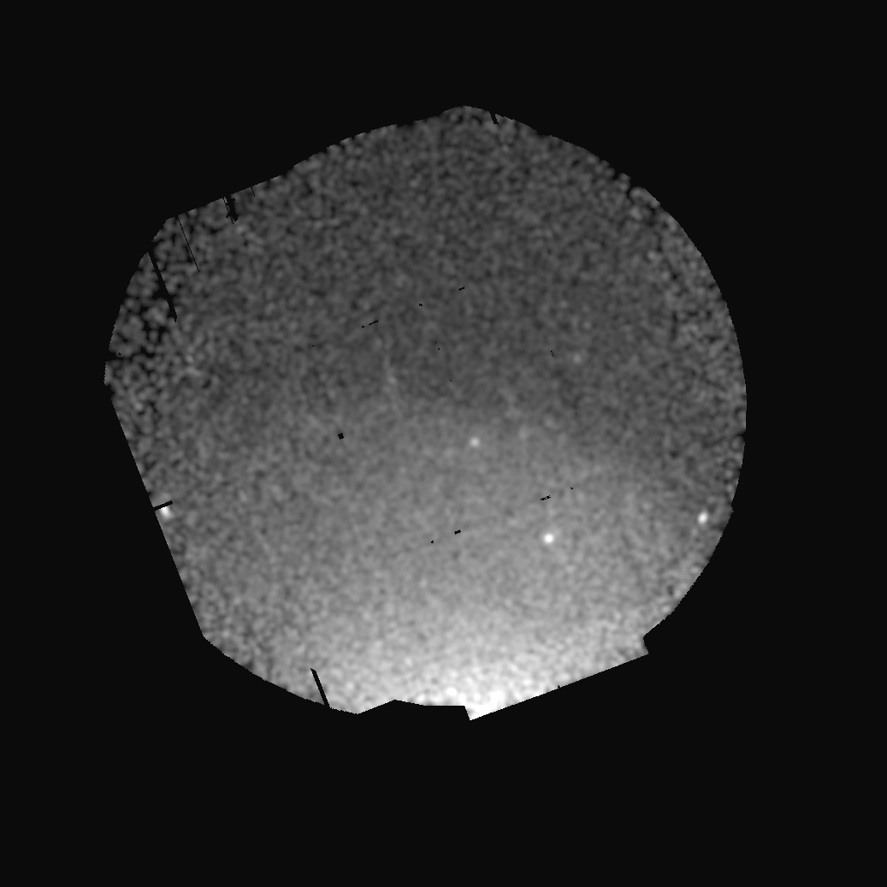
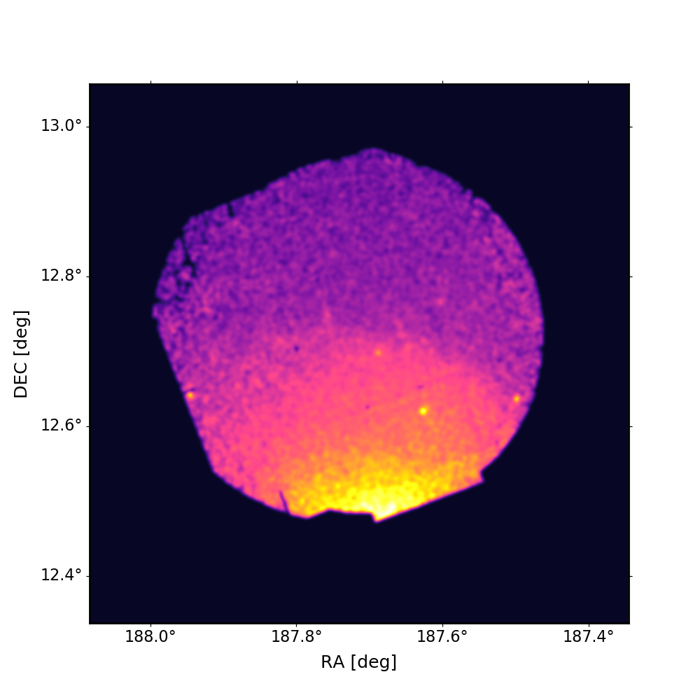

# Create nice images from fits files
## For optical images

**Syntax:** <br>
```python
python3  create_subimages.py -r r_imgs.fits -g g_imgs.fits -b i_imgs.fits \
                             -o myimg2 -con ds9.con  -reg ds9.reg -bin 5
```

The script creates a three color images from the given fits files.
**If ds9 region file with the circle region(s) is given.**<br>
- If there is a single region, it creates the image around this given region and also draws the cirle around it. 
- If there are couple of regions in the file, it displays all the region on the whole image. 

It can also take **ds9 contour files** and overlays on the images.

CAVEATS: It uses, makesubimage, <font color='red'> stiff </font> and <font color='red'> swarp </font> programs from [Astromatic](https://www.astromatic.net/). 

The script can also be used for X-ray images to cut, overlay regions and contours. If one wants to color code a given X-ray image, it is better to use ```x-ray_color.py``` script described below.

- **Please let me know if you encounter any issues**


# x-ray_color.py

**Syntax:** <br>
```python
python3 x-ray_color.py -f fitsfile.fits -o outputname ((-cmap inferno) (-sm 3) (-cr True) (-br 1.7)) <br>
```
call ```python3 x-ray_color.py -h``` to display help. <br>

Uses <font color='red'> Stiff </font> Program from Astromatic ! <br>

One can also investigate a couple of different colormaps and smoothing probabilities before actually running the code with a choice. Simply call the function with ```-cc 1``` or ```-sc 1``` arguments (as for colormap check and smoothing checks) which then will create figures with several possiblities are displayed. 

Example output; grey scale tif image and colored image with the given parameters.

<table><tr>
<td>  </td>
<td>  </td>
</tr></table>
